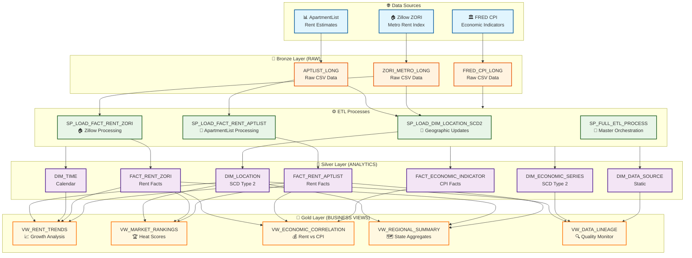
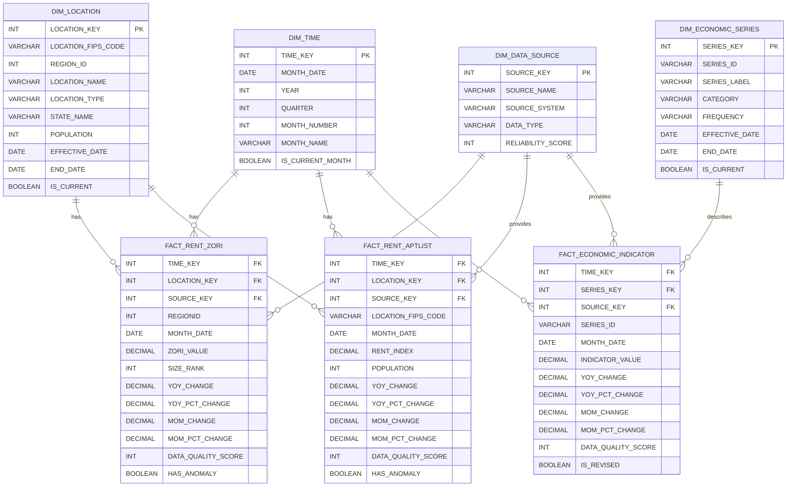

# Tampa Rent Signals Data Pipeline

A modern, production-ready data engineering pipeline for collecting, processing, and analyzing rental market data from multiple sources. The system integrates data from Zillow, ApartmentList, and Federal Reserve Economic Data (FRED) using **dbt Core**, **Great Expectations**, and **Dagster** with Snowflake as the cloud data warehouse.

## 🏗️ Architecture Overview

### Data Flow Architecture
The system implements a **Bronze → Silver → Gold** layered architecture with SCD Type 2 historical tracking:



### Processing Layers
1. **🥉 Bronze (RAW)**: Raw CSV files ingested from S3 with minimal processing
2. **🥈 Silver (ANALYTICS)**: dbt-managed star schema with SCD Type 2 historical tracking  
3. **🥇 Gold (BUSINESS)**: dbt mart models optimized for business analytics
4. **⚙️ Orchestration**: Dagster software-defined assets with Great Expectations validation

## 📁 Project Structure

```
├── data/                    # Raw data files (local development)
│   └── raw/
│       ├── aptlist/        # ApartmentList data
│       ├── fred/           # Federal Reserve economic data
│       └── zillow/         # Zillow ZORI data
├── dbt_rent_signals/       # dbt Core project
│   ├── models/            # dbt models (staging, core, marts)
│   ├── snapshots/         # SCD Type 2 snapshots
│   ├── macros/            # dbt macros and utilities
│   ├── tests/             # dbt tests
│   └── dbt_project.yml    # dbt configuration
├── great_expectations/     # Data quality validation
│   ├── expectations/      # Validation rules by layer
│   ├── checkpoints/       # Automated validation workflows
│   └── validate_data_quality.py  # CLI validation script
├── dagster_rent_signals/   # Dagster orchestration layer
│   ├── assets/           # Software-defined assets
│   ├── jobs/             # Dagster jobs and schedules
│   ├── sensors/          # Event-driven workflows
│   ├── checks/           # Asset checks and validation
│   └── resources/        # Dagster resources (dbt, Snowflake, GE)
├── rent_signals_api/     # RESTful API application
│   ├── app/              # FastAPI application
│   ├── tests/            # API tests
│   ├── Dockerfile        # Container configuration
│   └── README.md         # API documentation
├── docs/                  # Documentation and diagrams
│   └── diagrams/         # Mermaid architecture diagrams
├── infra/                 # Infrastructure as code
│   └── aws/              # AWS infrastructure components
│       ├── policies/     # IAM policies and trust relationships
│       └── README.md     # AWS setup instructions
├── scripts/              # Data processing and utility scripts
│   ├── standardize.py    # Main data transformation script
│   ├── debug_csv_locally.sh   # Local CSV validation
│   └── test_pipeline_end_to_end.sh  # End-to-end testing
├── sql/                  # Legacy SQL components (deprecated)
│   ├── schema/          # Original Snowflake schema
│   ├── etl/             # Legacy stored procedures
│   └── views/           # Legacy business views
├── standardized/        # Processed data in standardized format
├── temp/                # Temporary files and debug outputs
├── CLAUDE.md           # AI assistant guidance
├── Makefile            # Infrastructure automation commands
└── README.md           # This file
```

## 🚀 Quick Start

### Prerequisites
- **AWS CLI** configured with appropriate permissions
- **Python 3.8+** with virtual environment support
- **Snowflake account** with ACCOUNTADMIN privileges
- **dbt Core** 1.6+ installed
- **Make utility** for infrastructure automation

### 1. Environment Setup

```bash
# Set required environment variables
export AWS_PROFILE=default
export AWS_REGION=us-east-1
export BUCKET=rent-signals-dev-<your-initials>
export TODAY=$(date +%F)
```

### 2. Infrastructure Deployment

```bash
# View all available commands
make help

# Deploy complete infrastructure
make create-bucket create-prefixes upload-samples verify

# Create IAM policies for Snowflake integration
make create-readonly-policy
```

### 3. Data Processing

```bash
# Transform raw data to standardized format
python scripts/standardize.py

# Validate processed data locally
./scripts/debug_csv_locally.sh

# Run end-to-end pipeline test
./scripts/test_pipeline_end_to_end.sh
```

### 4. Modern dbt + Great Expectations Pipeline

```bash
# Install dbt dependencies
cd dbt_rent_signals
dbt deps

# Set up Snowflake connection
cp profiles.yml ~/.dbt/profiles.yml
# Edit with your Snowflake credentials

# Run dbt pipeline
dbt run --models staging
dbt run --models core  
dbt run --models marts

# Run data quality validation
cd ../great_expectations
python validate_data_quality.py --layer all
```

### 5. RESTful API Setup

```bash
# Navigate to API directory
cd ../rent_signals_api

# Set up environment
cp .env.example .env
# Edit .env with your Snowflake credentials

# Install dependencies
pip install -r requirements.txt

# Run the API
uvicorn app.main:app --reload --host 0.0.0.0 --port 8000

# Access API documentation
# http://localhost:8000/docs
```

### 6. Legacy SQL Setup (Optional)

For the original stored procedure approach:

```sql
-- 1. Run initial setup
@sql/schema/snowflake_setup.sql

-- 2. Create star schema  
@sql/schema/analytics_schema_ddl.sql

-- 3. Deploy ETL procedures
@sql/etl/etl_procedures.sql

-- 4. Run full ETL process
CALL RENTS.ANALYTICS.SP_FULL_ETL_PROCESS();
```

## 🏛️ Data Warehouse Design

### Star Schema with SCD Type 2

The data warehouse implements a dimensional model optimized for analytical queries with full historical tracking:



**Key Features:**
- **🔄 SCD Type 2**: Historical tracking via dbt snapshots for dimensions that change over time
- **📊 Pre-calculated Measures**: YoY/MoM changes computed in dbt models with window functions
- **🛡️ Data Quality**: Great Expectations validation with 100+ business rule checks
- **⚡ Performance**: Clustered tables and optimized dbt materializations
- **📋 Lineage**: Complete data lineage through dbt docs and Great Expectations
- **🤖 Modern Stack**: dbt Core + Great Expectations + Dagster orchestration

### Analytics Layer

Business-friendly dbt mart models for analytics:
- **mart_rent_trends**: Comprehensive cross-source rent trend analysis with investment scoring
- **mart_market_rankings**: Metro competitiveness rankings with heat scores and recommendations
- **mart_economic_correlation**: Rent vs inflation correlation with policy implications
- **mart_regional_summary**: State and national market characterization
- **mart_data_lineage**: Operational data quality monitoring and source tracking

## 📊 Data Sources

### Zillow ZORI (Zillow Observed Rent Index)
- **Coverage**: Metro areas across the United States
- **Frequency**: Monthly updates
- **Metrics**: Rent index values, year-over-year changes
- **Format**: Wide format (monthly columns) → standardized to long format

### ApartmentList
- **Coverage**: Counties and metro areas
- **Frequency**: Monthly updates
- **Metrics**: Rent estimates, population data
- **Format**: Wide format (YYYY_MM columns) → standardized to long format

### Federal Reserve Economic Data (FRED)
- **Coverage**: National economic indicators
- **Frequency**: Monthly updates
- **Metrics**: Consumer Price Index (CPI), Housing CPI
- **Format**: Already in long format

## 🔧 Modern Data Stack

### dbt Core - Analytics Engineering
- **Staging Models**: Clean and standardize raw data with data quality scoring
- **Core Models**: Star schema with SCD Type 2 snapshots for historical tracking
- **Mart Models**: Business-ready analytics with pre-calculated metrics
- **Incremental Processing**: Efficient updates for large datasets
- **Documentation**: Auto-generated lineage and model documentation

### Great Expectations - Data Quality
- **100+ Validation Rules**: Comprehensive business rule validation
- **Automated Checkpoints**: Pipeline-integrated quality gates
- **Statistical Validation**: Outlier detection and range checking
- **Data Profiling**: Automated data documentation and monitoring
- **Failure Alerting**: Configurable notifications on quality issues

### Dagster - Orchestration
- **Software-Defined Assets**: 15 assets covering all dbt models
- **Asset Checks**: 12 comprehensive validation checks integrating Great Expectations
- **Incremental Processing**: Smart re-computation of downstream assets
- **Scheduling**: Daily and weekly automated execution
- **Monitoring**: Built-in observability and alerting via Dagster UI
- **Sensors**: Event-driven processing based on data freshness

### RESTful API - Data Access
- **FastAPI Framework**: Production-ready API with automatic documentation
- **Market Data Endpoints**: Real-time rental market analysis and trends
- **Price Drop Detection**: Automated alerts for rental deals and opportunities
- **Market Rankings**: Investment attractiveness and heat score analysis
- **Economic Correlation**: Rent vs inflation analysis with policy insights
- **Regional Analytics**: State and metro-level market summaries

### Data Quality Framework
- **Layer-Specific Validation**: Different standards for staging vs marts
- **Business Rule Enforcement**: Rent growth limits, CPI validation
- **Cross-Source Consistency**: Unified metrics across data sources
- **Operational Monitoring**: Data freshness and pipeline health checks

## 🔐 Security & Compliance

### AWS Security
- **S3 Buckets**: Private with encryption at rest
- **IAM Policies**: Least-privilege access controls
- **OIDC Integration**: Keyless GitHub Actions authentication
- **No Credentials**: Environment variable based configuration

### Data Governance
- **Lineage Tracking**: Complete data provenance
- **Version Control**: All code and configurations in Git
- **Documentation**: Comprehensive inline and external docs
- **Audit Trail**: Snowflake query history and load logs

## 🚨 Troubleshooting

### Common Issues

**CSV Loading Errors:**
```sql
@sql/debug/debug_snowflake_csv.sql
```

**Data Quality Issues:**
```sql
SELECT * FROM RENTS.GOLD.VW_DATA_LINEAGE;
```

**Local Validation:**
```bash
./scripts/debug_csv_locally.sh
```

### Debug Tools
- Local CSV inspection scripts
- Snowflake validation queries
- End-to-end pipeline testing
- Data lineage and quality monitoring views

## 📈 Usage Examples

### Business Analytics with dbt Marts

```sql
-- Top 10 fastest growing rental markets
SELECT 
    location_name,
    state_name,
    yoy_pct_change,
    rent_value,
    investment_attractiveness_score,
    market_temperature
FROM mart_rent_trends 
WHERE data_source = 'Zillow ZORI'
  AND year = YEAR(CURRENT_DATE())
ORDER BY yoy_pct_change DESC
LIMIT 10;

-- Market heat analysis with investment recommendations
SELECT 
    location_name,
    state_name,
    market_heat_score,
    market_classification,
    investment_recommendation,
    risk_assessment
FROM mart_market_rankings
WHERE market_size_category = 'Major Metro (5M+)'
ORDER BY market_heat_score DESC;

-- Economic correlation analysis
SELECT 
    year,
    quarter,
    economic_regime,
    affordability_pressure,
    policy_implications,
    rent_housing_cpi_spread
FROM mart_economic_correlation
WHERE year >= 2020
ORDER BY year, quarter;
```

### Data Quality Monitoring

```sql
-- Operational dashboard
SELECT 
    table_name,
    source_name,
    data_freshness_status,
    data_quality_status,
    overall_reliability_score,
    days_since_latest_data
FROM mart_data_lineage
ORDER BY overall_reliability_score DESC;
```

### dbt Commands

```bash
# Run specific mart models
dbt run --models mart_rent_trends
dbt run --models mart_market_rankings

# Test data quality
dbt test --models staging
dbt test --models core

# Generate documentation
dbt docs generate
dbt docs serve
```

## 🛠️ Development

### Adding New Data Sources
1. Create extraction script in `scripts/`
2. Add transformation logic to `standardize.py`
3. Update S3 structure and IAM policies
4. Create dbt staging model in `models/staging/`
5. Add to core dimensions/facts as needed
6. Create mart models for business analytics
7. Add Great Expectations validation suite
8. Update Dagster assets (when implemented)

### Testing Strategy
- **dbt tests**: Schema validation and business rules
- **Great Expectations**: Comprehensive data quality validation
- **Integration tests**: End-to-end pipeline validation
- **Unit tests**: Python transformation logic
- **Data quality monitoring**: Continuous validation

## 📄 License

This project is for educational and analytical purposes. Data sources have their own terms of use.

## 🤝 Contributing

This project demonstrates modern data engineering best practices. The current implementation includes:

**✅ Production Features Already Implemented:**
- dbt Core for analytics engineering
- Great Expectations for comprehensive data quality
- SCD Type 2 historical tracking
- Comprehensive business rule validation
- Data lineage and documentation
- Modular, testable codebase

**🚀 Future Enhancements:**
- Dagster orchestration (in progress)
- Real-time data ingestion
- Machine learning feature store
- Advanced alerting and monitoring
- Auto-scaling infrastructure
- Data mesh architecture