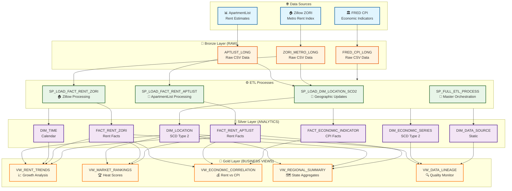
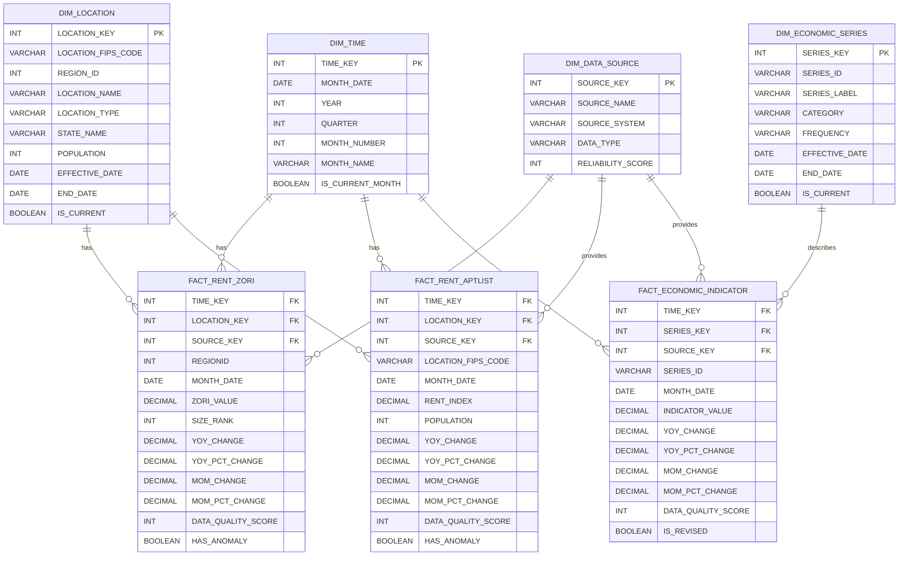

# Tampa Rent Signals Data Pipeline

A comprehensive data engineering pipeline for collecting, processing, and analyzing rental market data from multiple sources. The system integrates data from Zillow, ApartmentList, and Federal Reserve Economic Data (FRED) into a production-ready Snowflake data warehouse.

## 🏗️ Architecture Overview

### Data Flow Architecture
The system implements a **Bronze → Silver → Gold** layered architecture with SCD Type 2 historical tracking:



### Processing Layers
1. **🥉 Bronze (RAW)**: Raw CSV files ingested from S3 with minimal processing
2. **🥈 Silver (ANALYTICS)**: Cleaned, validated star schema with SCD Type 2 historical tracking  
3. **🥇 Gold (BUSINESS)**: Aggregated, business-friendly views optimized for analytics
4. **⚙️ ETL**: Automated stored procedures handling all data transformations

## 📁 Project Structure

```
├── data/                    # Raw data files (local development)
│   └── raw/
│       ├── aptlist/        # ApartmentList data
│       ├── fred/           # Federal Reserve economic data
│       └── zillow/         # Zillow ZORI data
├── docs/                   # Documentation and sample data
│   └── diagrams/          # Mermaid architecture diagrams
├── infra/                  # Infrastructure as code
│   └── aws/               # AWS infrastructure components
│       ├── policies/      # IAM policies and trust relationships
│       └── README.md      # AWS setup instructions
├── scripts/               # Data processing and utility scripts
│   ├── standardize.py     # Main data transformation script
│   ├── debug_csv_locally.sh    # Local CSV validation
│   ├── test_pipeline_end_to_end.sh  # End-to-end testing
│   └── *.py              # Source-specific processing scripts
├── sql/                   # Data warehouse SQL components
│   ├── schema/           # Database schema definitions
│   ├── etl/              # ETL stored procedures
│   ├── views/            # Analytics and business intelligence views
│   ├── debug/            # Debugging and troubleshooting scripts
│   └── README.md         # SQL components documentation
├── standardized/         # Processed data in standardized format
├── temp/                 # Temporary files and debug outputs
├── CLAUDE.md            # AI assistant guidance
├── Makefile             # Infrastructure automation commands
└── README.md            # This file
```

## 🚀 Quick Start

### Prerequisites
- AWS CLI configured with appropriate permissions
- Python 3.8+ with pandas
- Snowflake account with necessary privileges
- Make utility for infrastructure automation

### 1. Environment Setup

```bash
# Set required environment variables
export AWS_PROFILE=default
export AWS_REGION=us-east-1
export BUCKET=rent-signals-dev-<your-initials>
export TODAY=$(date +%F)
```

### 2. Infrastructure Deployment

```bash
# View all available commands
make help

# Deploy complete infrastructure
make create-bucket create-prefixes upload-samples verify

# Create IAM policies for Snowflake integration
make create-readonly-policy
```

### 3. Data Processing

```bash
# Transform raw data to standardized format
python scripts/standardize.py

# Validate processed data locally
./scripts/debug_csv_locally.sh

# Run end-to-end pipeline test
./scripts/test_pipeline_end_to_end.sh
```

### 4. Data Warehouse Setup

```sql
-- 1. Run initial setup
@sql/schema/snowflake_setup.sql

-- 2. Create star schema
@sql/schema/analytics_schema_ddl.sql

-- 3. Deploy ETL procedures
@sql/etl/etl_procedures.sql

-- 4. Create analytics views
@sql/views/gold_layer_views.sql

-- 5. Run full ETL process
CALL RENTS.ANALYTICS.SP_FULL_ETL_PROCESS();
```

## 🏛️ Data Warehouse Design

### Star Schema with SCD Type 2

The data warehouse implements a dimensional model optimized for analytical queries with full historical tracking:



**Key Features:**
- **🔄 SCD Type 2**: Historical tracking for dimensions that change over time (LOCATION, ECONOMIC_SERIES)
- **📊 Pre-calculated Measures**: YoY/MoM changes computed during ETL for performance
- **🛡️ Data Quality**: Built-in scoring (1-10) and statistical anomaly detection
- **⚡ Performance**: Clustered fact tables and materialized views for fast queries
- **📋 Lineage**: Complete data provenance tracking from source to analytics

### Analytics Layer

Business-friendly views for common analytical patterns:
- **VW_RENT_TRENDS**: Comprehensive rent trend analysis
- **VW_MARKET_RANKINGS**: Metro competitiveness and heat scores
- **VW_ECONOMIC_CORRELATION**: Rent vs inflation correlation
- **VW_REGIONAL_SUMMARY**: State and national aggregations
- **VW_DATA_LINEAGE**: Data quality monitoring

## 📊 Data Sources

### Zillow ZORI (Zillow Observed Rent Index)
- **Coverage**: Metro areas across the United States
- **Frequency**: Monthly updates
- **Metrics**: Rent index values, year-over-year changes
- **Format**: Wide format (monthly columns) → standardized to long format

### ApartmentList
- **Coverage**: Counties and metro areas
- **Frequency**: Monthly updates
- **Metrics**: Rent estimates, population data
- **Format**: Wide format (YYYY_MM columns) → standardized to long format

### Federal Reserve Economic Data (FRED)
- **Coverage**: National economic indicators
- **Frequency**: Monthly updates
- **Metrics**: Consumer Price Index (CPI), Housing CPI
- **Format**: Already in long format

## 🔧 ETL Process

### Data Standardization
All data sources are transformed to a consistent long format:
```
month | location_id | metric_value | [source-specific columns]
```

### Loading Strategy
1. **Extract**: Download from source APIs/files
2. **Transform**: Standardize format and validate quality
3. **Load**: Upload to S3 with date partitioning
4. **Warehouse**: ETL procedures with SCD Type 2 logic

### Data Quality Measures
- **Validation**: Schema validation and data type checks
- **Anomaly Detection**: Statistical outlier identification
- **Completeness**: Null value and missing data tracking
- **Consistency**: Cross-source data validation

## 🔐 Security & Compliance

### AWS Security
- **S3 Buckets**: Private with encryption at rest
- **IAM Policies**: Least-privilege access controls
- **OIDC Integration**: Keyless GitHub Actions authentication
- **No Credentials**: Environment variable based configuration

### Data Governance
- **Lineage Tracking**: Complete data provenance
- **Version Control**: All code and configurations in Git
- **Documentation**: Comprehensive inline and external docs
- **Audit Trail**: Snowflake query history and load logs

## 🚨 Troubleshooting

### Common Issues

**CSV Loading Errors:**
```sql
@sql/debug/debug_snowflake_csv.sql
```

**Data Quality Issues:**
```sql
SELECT * FROM RENTS.GOLD.VW_DATA_LINEAGE;
```

**Local Validation:**
```bash
./scripts/debug_csv_locally.sh
```

### Debug Tools
- Local CSV inspection scripts
- Snowflake validation queries
- End-to-end pipeline testing
- Data lineage and quality monitoring views

## 📈 Usage Examples

### Business Analytics

```sql
-- Top 10 fastest growing rental markets
SELECT 
    LOCATION_NAME,
    STATE_NAME,
    YOY_PCT_CHANGE,
    RENT_VALUE
FROM RENTS.GOLD.VW_RENT_TRENDS 
WHERE DATA_SOURCE = 'Zillow ZORI'
ORDER BY YOY_PCT_CHANGE DESC
LIMIT 10;

-- Rent vs inflation correlation
SELECT 
    YEAR,
    QUARTER,
    AVG(RENT_CPI_SPREAD) AS rent_inflation_spread
FROM RENTS.GOLD.VW_ECONOMIC_CORRELATION
WHERE YEAR >= 2020
GROUP BY YEAR, QUARTER
ORDER BY YEAR, QUARTER;
```

### Operational Monitoring

```sql
-- Data freshness dashboard
SELECT 
    SOURCE_NAME,
    DAYS_SINCE_LATEST_DATA,
    DATA_QUALITY_STATUS,
    RECORD_COUNT
FROM RENTS.GOLD.VW_DATA_LINEAGE;
```

## 🛠️ Development

### Adding New Data Sources
1. Create extraction script in `scripts/`
2. Add transformation logic to `standardize.py`
3. Update S3 structure and IAM policies
4. Create corresponding fact/dimension tables
5. Add ETL procedures and analytics views

### Testing
- Unit tests for transformation scripts
- Integration tests for ETL procedures
- End-to-end pipeline validation
- Data quality monitoring

## 📄 License

This project is for educational and analytical purposes. Data sources have their own terms of use.

## 🤝 Contributing

This is a demonstration project. For production use, consider:
- Additional data validation
- Enhanced error handling
- Monitoring and alerting
- Performance optimization
- Security hardening